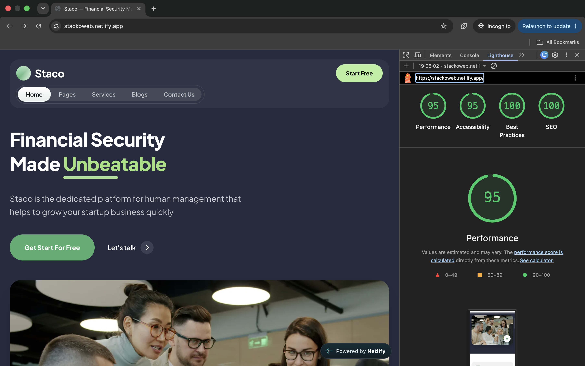

# DECISIONS

## The sliding indicator

I used one `measure(i)` function to work out the position and width of the tabs. It reads each tab’s `offsetLeft` and `offsetWidth`, then uses those values for `translateX` and `width`.

There are two pills: one for the active tab and one for hover. The active pill follows the selected tab. The hover pill works a little differently. When nothing is being hovered, it covers the full width of the tab bar. When a tab is hovered, it moves and shrinks to that tab, then expands back when the pointer leaves. This gives a similar effect to the shared-layout animation in the original.

I didn’t hardcode the positions or widths. A `ResizeObserver`, a deep watcher on the `tabs` prop, and `document.fonts.ready` all trigger `measure()` again when the layout can change. So if a tab is added or a label changes, the indicator automatically adjusts.

The hover behaviour is behind `@media (hover: hover)` so it doesn’t cause issues on touch devices. For keyboard users, `@focus` uses the same indicator as the focus state.

I chose CSS transitions instead of adding a motion library. There are only two values being animated — position and width — so CSS is enough and avoids adding another dependency.

## Navigation on mobile

Below `1024px`, the header switches to two rows. The logo and **Start Free** button stay on the first row, while the tabs move to their own full-width row.

The tab row scrolls horizontally on smaller screens, and when the active tab changes, it is scrolled into view.

I used `1024px` as the breakpoint instead of `640px` because between 640px and 1024px, keeping everything on one row makes the tab labels too cramped and can cause them to clip. Wrapping the tabs gives them more room without hiding the navigation.

I didn’t use a hamburger menu because it would hide the animated tab indicator, which is one of the main interactions being assessed.

I checked the layout at 360px, 640px, 1024px and 1440px and confirmed that there is no horizontal page overflow.

## What I could not match exactly

### The typeface

The original appears to use a commercial font that I couldn’t identify from the rendered page. Rather than trying to guess the exact font, I focused on matching its measurements.

For example, the width-to-cap-height ratio of `"Made"` in the reference is 3.46, while Plus Jakarta Sans gives 4.19. I adjusted the font sizes to get the text widths closer to the reference.

The actual letterforms are still different, so some line breaks in longer pieces of text don’t match the original exactly.

### Photography

I couldn’t reuse the original stock photos because they are licensed to the template owner. I used free-licence alternatives instead.

I cropped the images to match the aspect ratios of the containers and converted them to WebP. The eight images are about 309 KB combined, compared with roughly 22 MB for the original images.

For the Why-choose-us section, I kept the subjects close to the centre of the crops. The panels change size depending on which one is active, so this helps keep the subject visible even when a panel becomes narrow.

### The hero video

The original has a muted autoplaying video. I used a still image with a working play/pause control instead.

The main reason was performance. An autoplaying video would add unnecessary cost on mobile for something that isn’t part of the assessed functionality.

### The hero green line animation

The original uses a curved, organic-looking line with some elastic movement as it connects to the image.

I recreated the same idea with a simpler geometric curve and linear easing. I tried different animation curves, but the result still doesn’t have exactly the same feel as the original.

The behaviour is otherwise the same: the line appears on load and animates alongside the word animation.

### Partner logos

I used text wordmarks instead of the actual partner logos.

### Omitted sections

I left out the following sections because they weren’t required by the brief:

* Blog posts
* The `200 / 156K / 23K` statistics section
* The BENEFITS "Most useful features" section

## Lighthouse (mobile)



## Where I used AI

**Tool:** Claude (Anthropic)

I used Claude throughout the build as a development assistant. I used it for the initial Nuxt 4 and Tailwind 4 setup, building sections from the reference screenshots, implementing the TabBar and its indicator, troubleshooting Netlify build errors, and explaining Vue 3 reactivity when I needed to verify how something worked.

I reviewed and tested the generated code rather than using it unchanged. When something didn’t match the reference or behaved incorrectly, I changed the implementation.

### Footer

Claude initially used `position: fixed` for the disclaimer. This caused it to sit in the middle of the viewport with a large empty space above it. I changed this to `sticky bottom-0`, which gave the footer the behaviour I wanted without needing a spacer.

### CTA section

The first implementation treated the white lines as separate diagonal bars beside the arrows. After comparing it with the reference, I realised the lines were supposed to look like one perspective road.

I changed the implementation to use a shared vanishing point instead of treating each line independently. The scale factor I got from the outer lanes was approximately 1.62, which confirmed that the perspective approach was consistent.

### Why-choose-us indicators

Claude suggested adding pagination dots and a green progress bar underneath the images. Those aren’t in the reference, so I removed them.

The actual design uses the white timer pill inside the active image as its indicator.

### Vue `watch()` and `deep: true`

Claude initially suggested that `deep: true` was unnecessary when watching a reactive object directly. That is correct for that particular case because Vue 3 deeply watches reactive objects by default.

However, the TabBar uses a getter:

```js
watch(() => props.tabs, ...)
```

In this case, nested mutations need to be detected explicitly, so I verified this against the Vue 3 documentation and kept `deep: true`.

